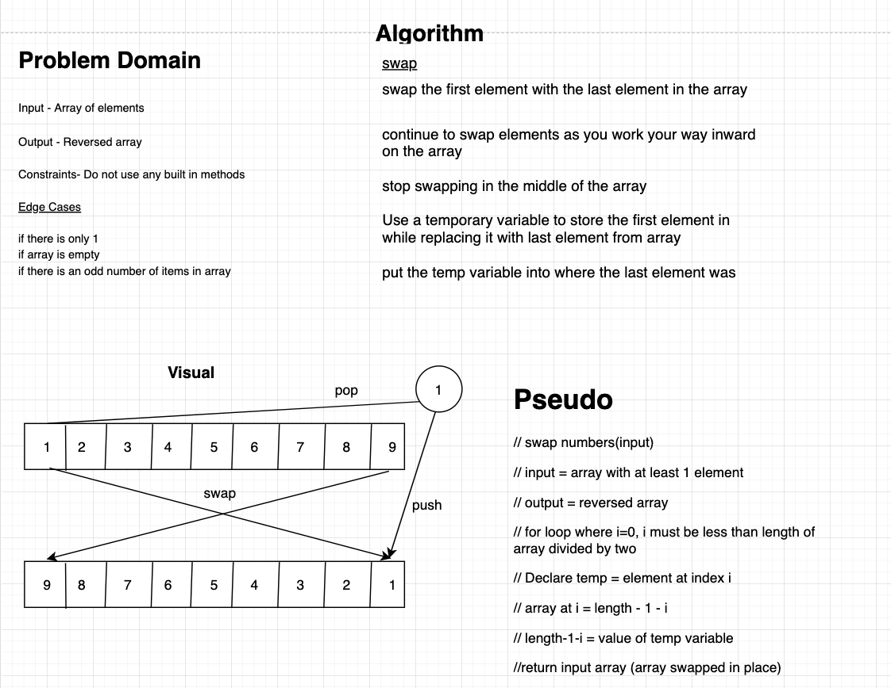

# Reverse an Array
<!-- Short summary or background information -->
Code challenge 1 is to reverse the order of elements in a given array

## Challenge
<!-- Description of the challenge -->
Take an array as an argument in a function where the elements are reversed *without* using built in methods. Return the rearranged array.

## Approach & Efficiency
<!-- What approach did you take? Why? What is the Big O space/time for this approach? -->
I took the approach of looping through half of the length of the given array, on each iteration the element would temporarily be stored in a variable while the last element of the array became the value where the removed element was previously. The value temporarily stored would then get placed at the end of the array. Each iteration would work inward, stopping at the length of the array times two. I chose this approach because it was the only way that came to mind as we started to whiteboard the solution.

## Solution
<!-- Embedded whiteboard image -->

