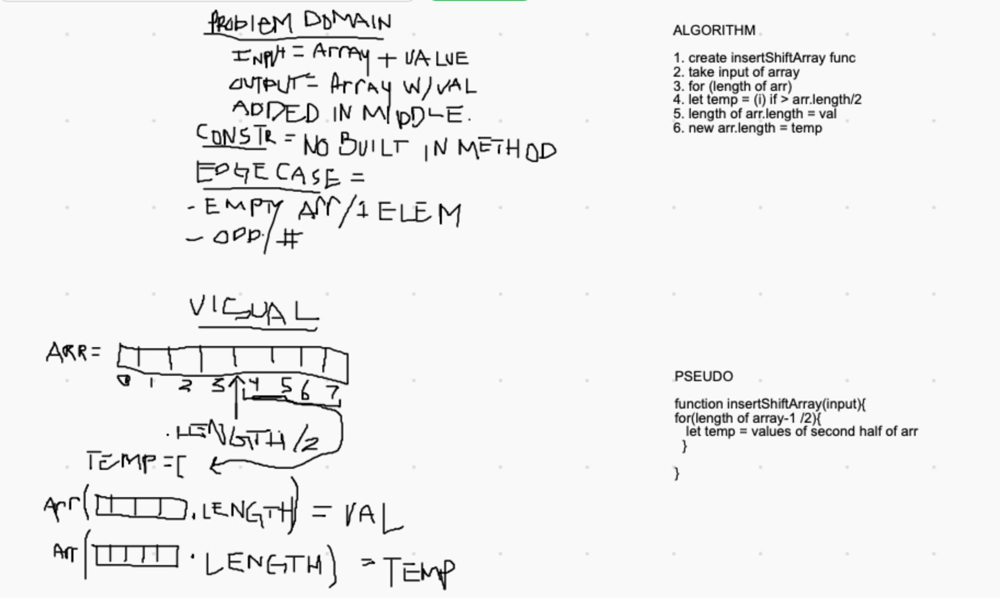

# Reverse an Array
<!-- Short summary or background information -->
The task was to add a provided value into the middle of a given array.

## Challenge
<!-- Description of the challenge -->
Take an array as an argument in a function and insert a given value into the middle of the array without using built-in methods.

## Approach & Efficiency
<!-- What approach did you take? Why? What is the Big O space/time for this approach? -->
I planned on looping through half of the length of the array and storing half of the elements temporarily in a variable while adding the given value onto the end of the first half of the array. I realized this didn't make sense and wouldn't work so my solution was not efficient.

## Solution
<!-- Embedded whiteboard image -->

