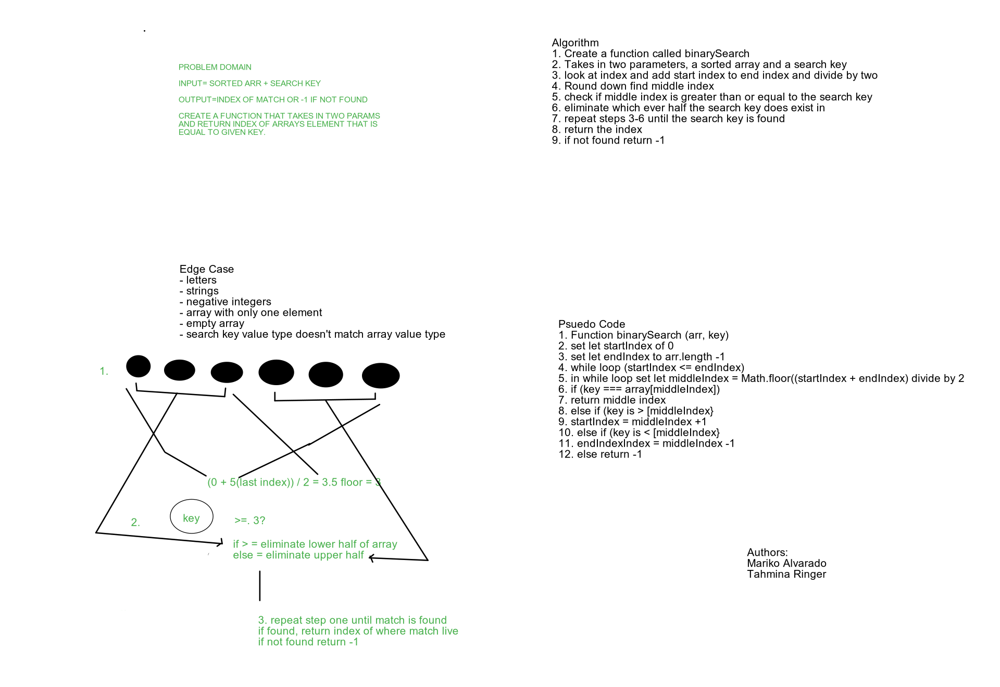

# Array Binary Search
<!-- Short summary or background information -->
The task was to take the input of a sorted array and a search key, and find where in the given array the matching value to the search key is located

## Challenge
<!-- Description of the challenge -->
Take an an array and search key as an argument in a function called BinarySearch. Without using built in methods, find the index of the array element which matches the key or return -1 if there is no match.

## Approach & Efficiency
<!-- What approach did you take? Why? What is the Big O space/time for this approach? -->
after assigning the first index and the last index of the array into variables, we ran a while loop as long as the first index was less than the last index. we then created a variable and assigned its value as the middle index of the array and using that middle index we determine if its value was equal to,less than or greater than the key. If equal we would return the index, if less than we would eliminate the greater half of the array, if greater than we would eliminate the lower half of the array. If the match doesn't exist we would return -1. We didn't get to actually write our code but I think our solution will be efficient.

## Solution
<!-- Embedded whiteboard image -->

