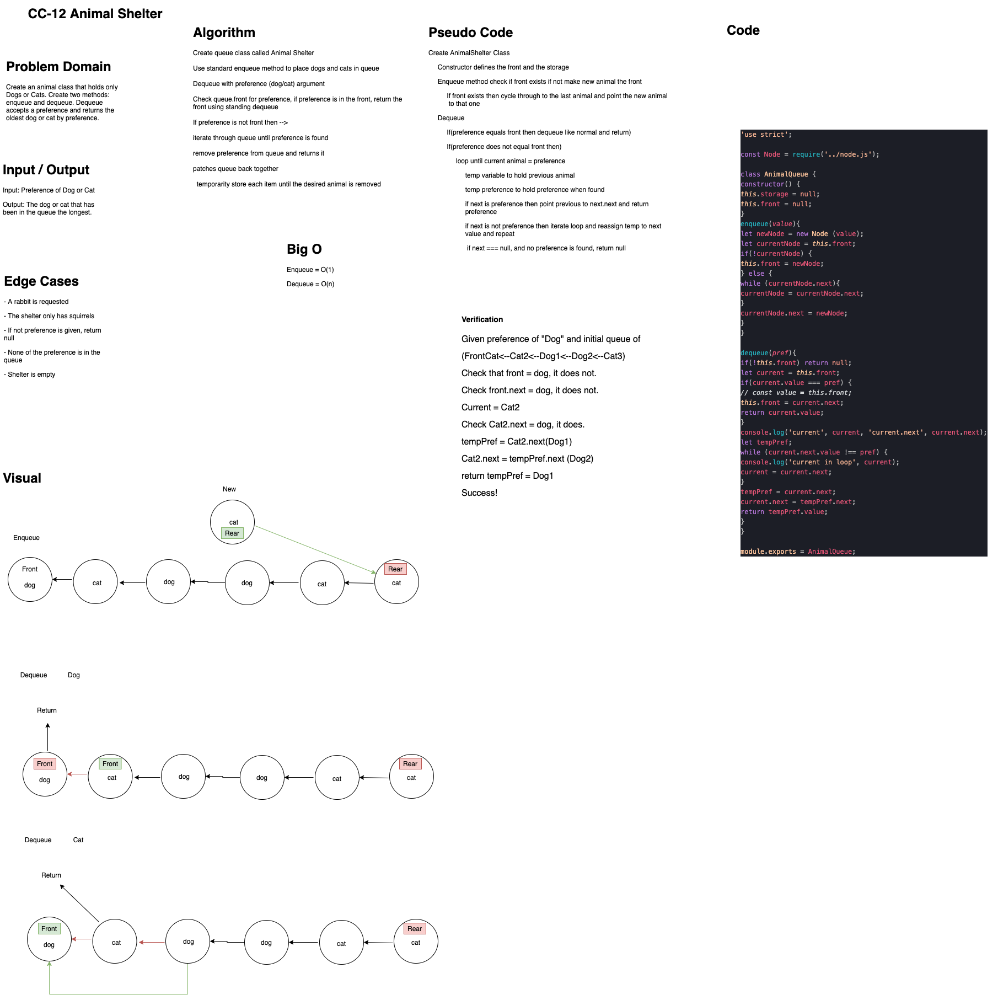

# Challenge Summary
<!-- Short summary or background information -->
Create an animal shelter class with enqueue and dequeue methods to shelter and retrieve the first animal in queue of a certain preference.

## Challenge Description
<!-- Description of the challenge -->
- enqueue(animal) to add either dog or cat to a single queue
- dequeue(pref) to retrieve either the first cat or dog in the queue, return null if preferred animal is not found.

## Approach & Efficiency
<!-- What approach did you take? Why? What is the Big O space/time for this approach? -->

We set up enqueue to O(1) since it is only adding one animal to the queue. The dequeue is O(n) because the length of the list can be unknown. If the animal at the front of the queue does not match the requested preference, the solution is to iterate through the queue until the first cat/dog is found, temporarily hold that animal in a variable while patching the current animal's next to reference the next of the preferred animal, afterward remove the preferred animal from the queue with return.

## Solution/partners

Ricardo and Simon
<!-- Embedded whiteboard image -->

