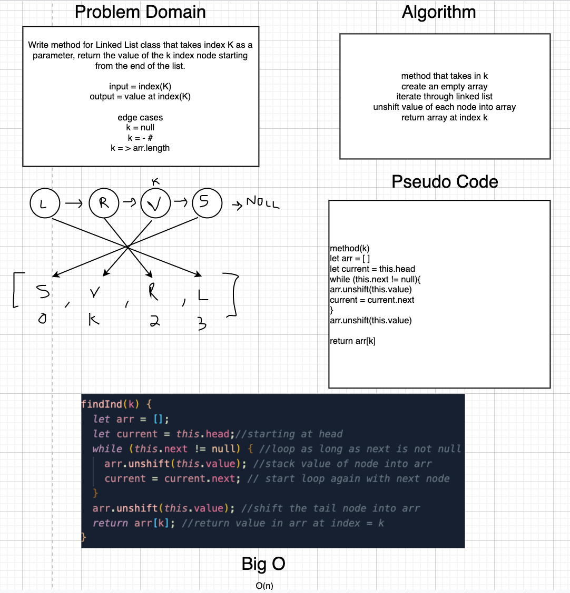

# Singly Linked List
<!-- Short summary or background information -->
Create a linked list to pass multiple tests.

## Challenge
<!-- Description of the challenge -->
Create a Node class with properties "next" and "value" and create a LinkedList class with a property for "head" that will create an empty list upon instantiation. Create methods to insert nodes, find if an element exists within the list and return list elements as a string.

## Approach & Efficiency
<!-- What approach did you take? Why? What is the Big O space/time for this approach? -->
I took the approach of inserting each new node at the beginning of the list rather than in order like I had started to. As I wrote my tests I realized I am still very confused by how ll's work so in order to test for whether or not my list includes a value I built it out to test incrementally. It works for the parameters I gave but realistically it would not work against a linked list of an unknown size. My toString function starts with current as the head and whichever node is currently observed in the loop has it value added to a string, but it doesn't work properly yet. I still don't understand the Big 0 fully yet.

## API
<!-- Description of each method publicly available to your Linked List -->
`insert()` - Inserts new node at beginning of linked list making whichever value that was added last, the head and pointing to the value that was previously head.

`includes()` - Checks to see if a value exists within the linked list and returns either true or false.

`toString()` - Returns the elements found in a linked list as a string.

## Resources

Simon, Tahmina, Stacy, Tina

# Kth From End
<!-- Short summary or background information -->
Find value at index K

## Challenge
<!-- Description of the challenge -->
Write method for Linked List class that takes index K as a parameter, return the value of the k index node starting from the end of the list.

## Approach & Efficiency
<!-- What approach did you take? Why? What is the Big O space/time for this approach? -->
I took the approach of unshifting each nodes value into an array and returning the array element found at index = k. The big O is O(n)

## API
<!-- Description of each method publicly available to your Linked List -->
`insert()` - Inserts new node at beginning of linked list making whichever value that was added last, the head and pointing to the value that was previously head.

`includes()` - Checks to see if a value exists within the linked list and returns either true or false.

`toString()` - Returns the elements found in a linked list as a string.

`findK()` - Return value at index k.

## Resources

Ricardo

