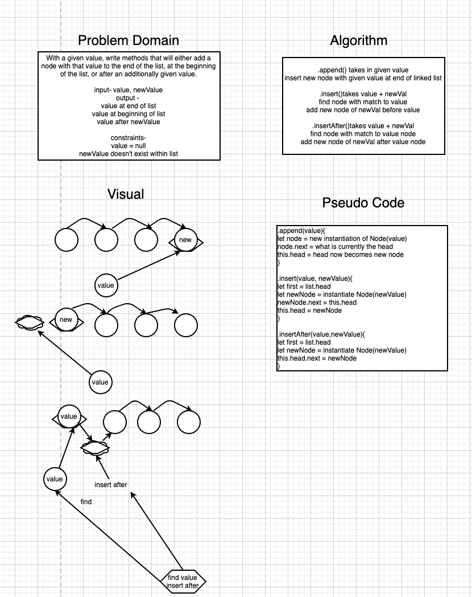

# Challenge Summary
<!-- Short summary or background information -->
Create three methods, .append(value), .insertBefore(value,newVal) and .insertAfter(value,newVal).

## Challenge Description
<!-- Description of the challenge -->
- .append(value) should a new node to end of list with value of `value`
- .insertBefore(value,newVal) should add a node with value of `newVal`immediately before `value`
- .insertAfter(value,newVal) should add a node with value of `newVal` immediately after `value`

## Approach & Efficiency
<!-- What approach did you take? Why? What is the Big O space/time for this approach? -->

## Solution
<!-- Embedded whiteboard image -->

