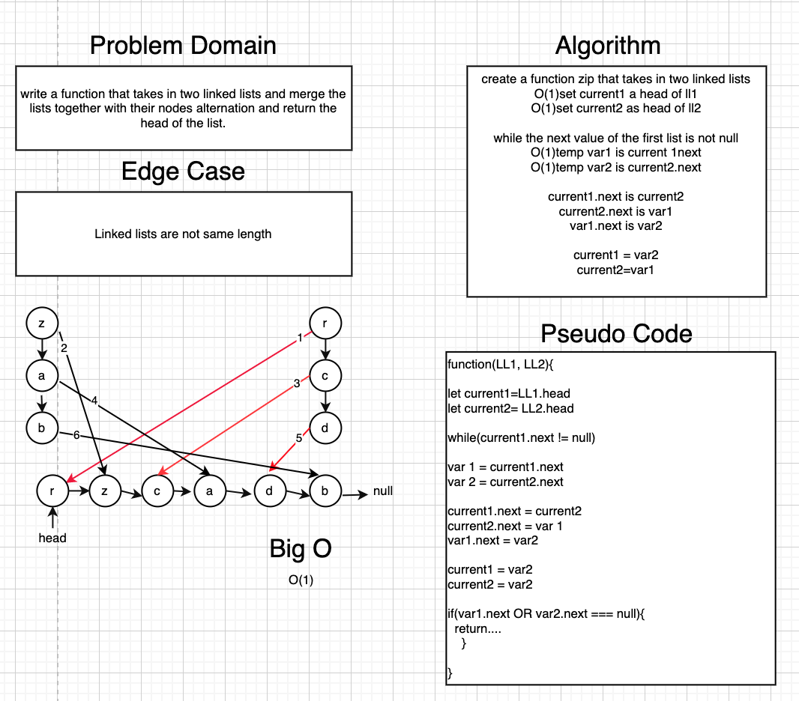

# Challenge Summary
<!-- Short summary or background information -->
Merge two linked lists together

## Challenge Description
<!-- Description of the challenge -->
Write a function that takes two linked lists as arguments and merge them together by alternating the order of nodes. Return the head of the new zipped list.

## Approach & Efficiency
<!-- What approach did you take? Why? What is the Big O space/time for this approach? -->

I took the approach of setting two *current* nodes being the head of each list. As I looped for the length of one list, I had two temporary variables pointing at the *next* node of each current node. current node 2 of the second list became the *next* node of the current node 1. the next of the current node 2 then became the temporarily stored node from temp var 1 and the next of temp var 1 became temp var 2. The big O is O(1) because the loop will only occur and build a new list as the long as the length of the first list, with everything only happening once within each iteration.

## Solution
<!-- Embedded whiteboard image -->

