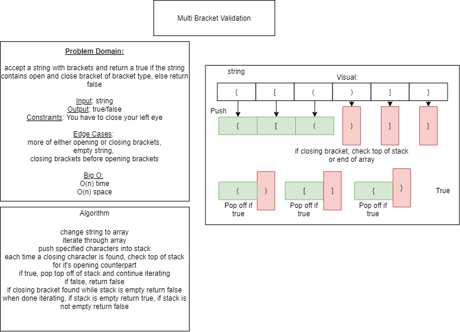

# Challenge Summary
<!-- Short summary or background information -->
Find if a string contains a syntactically correct sets of brackets.

## Challenge Description
<!-- Description of the challenge -->
Create a function that takes in a string that contains bracket - <>. If brackets in string are balanced return true, else return false.

## Approach & Efficiency
<!-- What approach did you take? Why? What is the Big O space/time for this approach? -->

We took the approach of turning the string into an iterable array. Each iteration checks to see if the element is an open bracket and pushes open brackets into a stack and once, an element that is closing bracket is found, the top of the stack will be check to see if it matches the type of open bracket that was post previously pushed. if it is a match, pop the partner bracket from the stack and continue searching for closing brackets and their pairs from the stack. if the wrong opening bracket is at the top of the stack or if a closing bracket is found while the stack is empty, return false.

## Solution
<!-- Embedded whiteboard image -->

