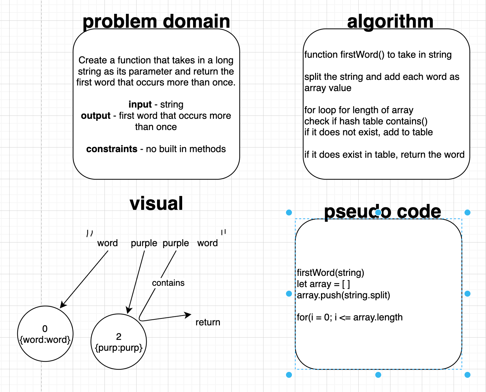

# Challenge Summary CC31
<!-- Short summary or background information -->
Take a k-ary tree inside of a function and return a new tree with the same structure but new values under specific condition.

## Challenge Description
<!-- Description of the challenge -->
find the first word in string that occurs more than once

## Approach & Efficiency 
<!-- What approach did you take? Why? What is the Big O space/time for this approach? -->
I wasn't sure where to start without using built in methods but started down the path of splitting the string and adding it into an array that could be looped through, with the intention of only adding words and not white spaces to the hash table. Within the loop I would first check to see if the table contains the hash and the matching key, if it didn't exist it would be added to the table. Checking to see what the table already contains as I am adding words to it would result in an O(1) for time and and O(n) for space(?)

## Solution
<!-- Embedded whiteboard image -->

