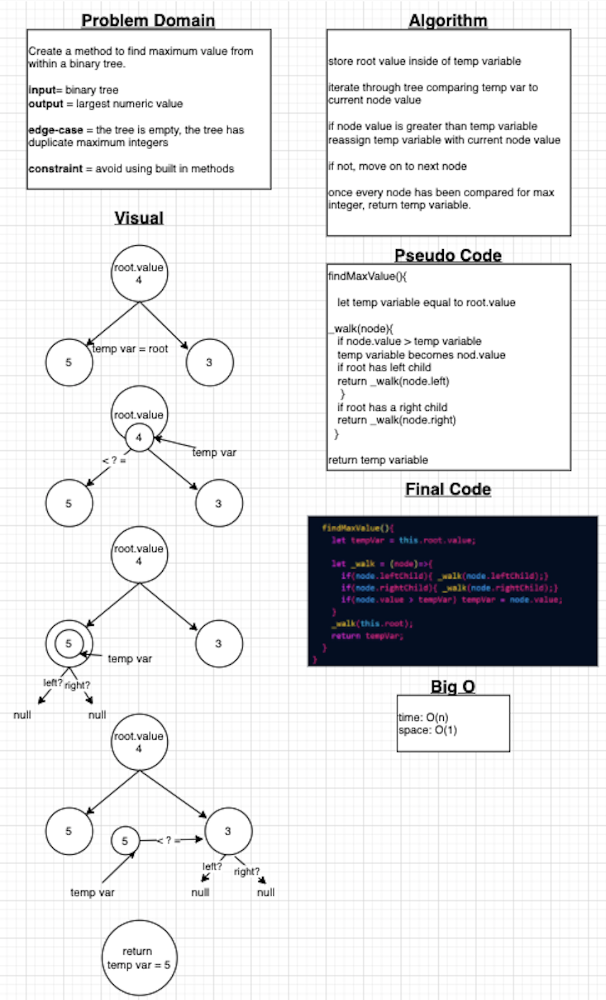

# Challenge Summary CC16
<!-- Short summary or background information -->
Find the greatest integer in a Binary Tree

## Challenge Description
<!-- Description of the challenge -->
Create an instance method `find-maximum-value` and return the greatest numeric value from within a Binary Tree without using built in methods.

## Approach & Efficiency
<!-- What approach did you take? Why? What is the Big O space/time for this approach? -->

The approach we took was to create a variable that would temporarily hold the current greatest integer, starting with the root node. Then we check each node within the tree using PreOrder traversal to determine whether or not the current node(left,right) existed and if so we would recursively call the GetMax method, sending it that nodes value to be compared to the the temp variable value, whichever number was greater would be established as the next comparing factor as other nodes were checked. The Big O for time is O(n) and the O(1) for space since we created a variable which stored a single value.

## Solution
<!-- Embedded whiteboard image -->

# Trees CC15
<!-- Short summary or background information -->
Create a Node class, a BinaryTree class and a BinarySearchTree class.

## Challenge
<!-- Description of the challenge -->

Create a node class with properties for value,left child and right child. Create a Binary Tree class with methods PreOrder, inOrder and postOrder that return an array with values from tree in the right order. Create a BinarySearchTree class with an add method that will create a new node and place it correctly within the tree, add another method named contains that will accept a value and return true or false if the value exists within the tree at least once.

## Approach & Efficiency
<!-- What approach did you take? Why? What is the Big O space/time for this approach? -->

I took the approach of creating an add method with and O(h) for time and O(1) for space. Because I'm unsure of how to construct add to a tree and *then* use a traversal method based on the new construct, I designed my test for preOrder to first add() and then send the root of the additions to the preOrder method. It was on the right track but it did not pass.

## API
<!-- Description of each method publicly available in each of your trees -->

`add()`

`preOrder()`

